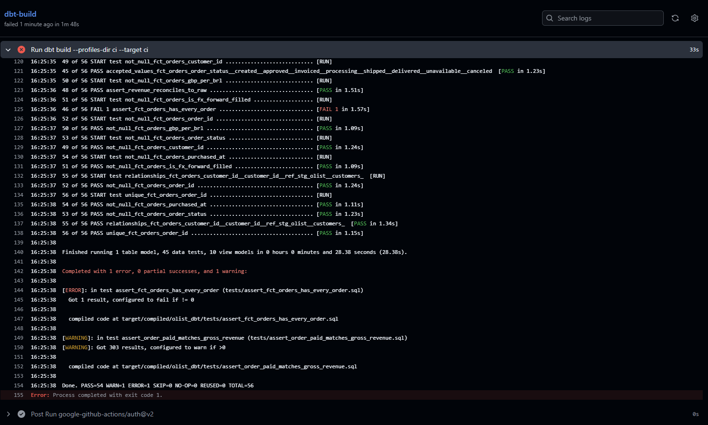
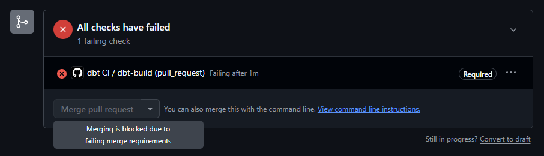

# Olist Analytics Platform
  An end-to-end analytics platform built from scratch: two ingestion pipelines (bulk CSV and an incremental API), a dbt project with staging, intermediate and mart layers, 45 tests including reconciliation to raw, and CI that blocks a bad change before it reaches main. The data is the Olist Brazilian e-commerce dataset, with revenue converted to GBP using ECB reference rates on the transaction date. Stack: Python, GCS, BigQuery (europe-west2), dbt Core, GitHub Actions.

## Architecture
  This represents how the process works.
  ```mermaid
flowchart LR
    A[Olist CSVs<br/>9 files] -->|load_olist.py<br/>bulk, full replace| G[(GCS landing<br/>load_date=…)]
    B[ECB API<br/>BRL, GBP] -->|load_fx.py<br/>incremental, MERGE| G
    G --> R[(BigQuery raw<br/>all STRING + _loaded_at)]
    R --> S[staging<br/>views: rename, cast]
    S --> I[intermediate<br/>FX daily, order aggregates]
    I --> M[marts<br/>fct_orders]
    L[(_log_ingestion)] -.-> R
    CI[GitHub Actions<br/>dbt build on every PR] -.-> M
```

## Design decisions
- **One `raw` dataset for both sources** (`raw.olist_*`, `raw.ecb_fx_rates`): enough at this scale; at a company each source would get its own dataset for ownership and access control.
- **A failed table doesn't stop the run.** The loader logs it as `failed`, carries on with the others, and exits non-zero so a scheduler or CI sees the failure. Re-running a single table is manual today (automatic retry from the log is in the TODO list).
  
### Ingestion
  - Everything in europe-west2, for UK data residency
    - BigQuery load job needs the GCS bucket in the same location as the dataset.
  - Landing in GCS by load_date, untouched, so any load can be replayed
  - Raw entirely in STRING, with types cast in staging, so a bad value never breaks the load
  - Temp table + atomic CREATE OR REPLACE: the final table is never half-loaded
  - Row-count reconciliation (local vs BigQuery) and refusing empty files
  - Append-only log (started / success / failed), so dead runs can be detected
  - FX: retries with backoff on 429/5xx/timeouts, no retry on other 4xx, a high-water mark with a 7-day lookback and MERGE on KEY + TIME_PERIOD
  - **The trade-off**
    - The loader protects each table individually. The atomic replace means a failed table keeps yesterday's version. But across tables, you might end up with olist_order_items from today and olist_orders from yesterday, which are out of step with each other.


### Modelling
- **Staging (views):** one model per source table, rename and cast only, so source changes are absorbed in one place.
- **Intermediate (ephemeral):** logic shared by more than one mart (daily FX, order aggregates).
- **Marts (tables):** what people query, built once rather than recomputed on every read.
- **CAST, not SAFE_CAST:** legitimate NULLs pass, malformed values fail the build.
- Timestamps converted from São Paulo local time to UTC
- fct_orders: one row per order, aggregated before the join (no fan-out)
- Revenue = items + freight. Payments are used for reconciliation (303 differ, 775 orders without items, 1 without payment)
- FX on the purchase date in São Paulo (IAS 21), a cross rate via EUR, forward-filled at weekends with is_forward_filled and last_ecb_date


### Data quality and freshness
  - 45 tests: structural + business rules + reconciliation against raw
  - warn_if / error_if: the 303 warn, a jump fails
  - Freshness on the data's own date (4/6 days, following the ECB calendar). Olist has no freshness because it's a static snapshot.


## CI: what stops a bad change
Every change reaches `main` through a pull request. GitHub Actions runs `dbt build` against a dedicated `dbt_ci` dataset, using a service account that can only read `raw` and write to `dbt_ci`. `main` is protected: the `dbt-build` check must pass before the merge button unlocks. Warnings don't block; failures do.

**Example:** a PR changed a `LEFT JOIN` to an `INNER JOIN` in `fct_orders.sql`. Revenue still reconciled, because the dropped orders had no items, but the row-count test caught 775 missing orders and the merge stayed blocked.




## What broke and what I did

  1. Rates with gaps on downtime, ECB load with `TODAY − 7` would leave gaps after downtime, to fix I changed to a high-water mark to query BQ for latest date loaded and will set `START_DATE = MAX(TIME_PERIOD) - 7` when calling the API.
  2. Force Stop script (CTRL+C), Python died mid process, BigQuery finished the job. The log going to say given table never completed because never finished, but the table was replaced in BQ when comparing when the table was replaced vs started_at in the log.
  3. Loaded empty file successfully, empty files would be load without flagging and creating empty tables. The fix was changing the script to refuse files with 0 rows.
  4. CI failed on dependency resolution. I'd moved from laptop to desktop and requirements.txt no longer matched any real environment. CI installs strictly from the file, so it caught what both machines hid. Fixed the pin, split the requirements, pip check after every install.
  5. BigQuery ingestion error, a row had a string field with line break causing to read as and new row. The fix was setting allow_quoted_newlines=True, plus a row-count comparison against the local file

  [Incidents document](docs/INCIDENTS.md)


## What I'd do differently at scale
  - The retry mechanism (--tables and --retry-failed)
  - Catch KeyboardInterrupt to log interrupted before stopping. (For CTRL+C)
  - record the BigQuery job_id in the log. Then a dead run can be matched to INFORMATION_SCHEMA.JOBS with a simple join, with no detective work.
  - Create ingestion/common.py with the shared functions and have both scripts import from it.
  - Ingestion and dbt share a local venv, so google-cloud-storage is held below 3.2 for dbt-bigquery. In production they'd run in separate environments, and the pin could be lifted.

## What this project is not
  - Not production: no team, no on-call, no scheduler (loaders run by hand), and Olist is a static snapshot, so freshness and incremental loading are demonstrated on the ECB source only. Not yet built: the semantic layer (MetricFlow) and a BI dashboard.

## Running it
  1. Start Google Cloud CLI
  2. Create Google Cloud storage buckets and Google BigQuery dataset
  3. Create `data` folder and copy `.env.example` to `.env` 
  4. Configure python environment
  5. Configure dbt

- More details [LINK](docs/setup.md)